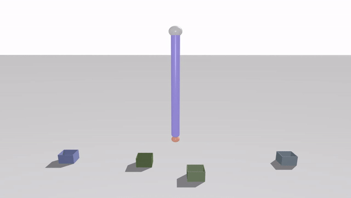
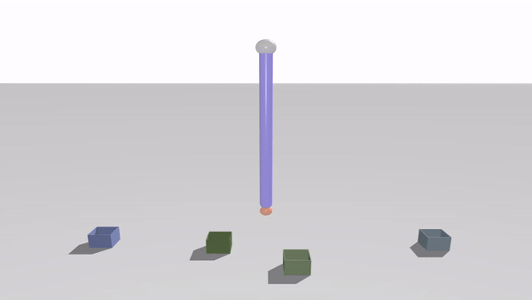
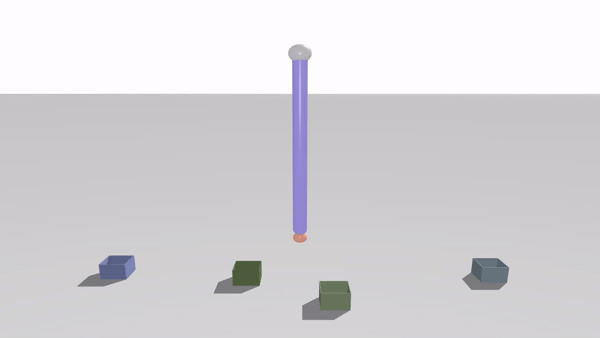

# Open-loop control of a soft arm in throwing tasks
This repository contains the supplementary material related to the work developed for the work submitted at [ICINCO 2022](https://icinco.scitevents.org/) 
## Abstract
This paper presents the implementation of an open-loop controller that allows a soft arm to throw objects in target positions. This valuable ability enables the robotic arm to expand its working space by tossing the objects outside it. Soft robots are characterized by high compliance and flexibility, which is paid in terms of dynamics that is highly non-linear and therefore hard to be modelled. An artificial neural network is employed to approximate the relationship between the actuation set and the target landing position, i.e., the direct model of the task. An optimization problem is defined to find the actuation set necessary to throw in a desired target. The proposed methodology has been tested on a soft robotic simulator (PyElastica). Results show that the open-loop controller allows throwing objects in a target position with an average error of 0.90 mm and a maximum error of 10.47 mm, which compared to the characteristic dimension of the work-space correspond respectively to 0.07 % and 0.83 %.
## Keywords
**Soft robotics, Throwing, Open-loop control, Neural network**
## Methodology

The methodology proposed is composed by four main steps:
1. _Actuation sets generation and throws simulation._ After establishing how the robot actuation is constructed and describing the overall movement, the dataset is taken by performing several throws and saving the various landing positions.
2. _Network Training._ An Artificial Neural Network (ANN) is used to create the direct model of the task.
3. _Definition of the optimisation problem._ This step is fundamental to find the actuation set necessary to throw an object in a desired position.
4. _Performing a throw._ Using the actuation set found at `Step 3`, the throw is performed to measure the accuracy of the method.

For futher information, please refer to the original [paper](https://github.com/diebia).

## Media
In this section, four attempts are made to demonstrate the validity of the proposed methodology.
### Target A
The [Target A](Videos/A_rod_video.mp4) is _1.26 m_ far from the base of the soft robotic arm, if we consider just the distance on the horizontal plane. 

### Target B
The [Target B](Videos/B_rod_video.mp4) is _0.31 m_ far from the base of the soft robotic arm, if we consider just the distance on the horizontal plane. 

### Target C
The [Target C](Videos/C_rod_video.mp4) is _0.63 m_ far from the base of the soft robotic arm, if we consider just the distance on the horizontal plane. 

### Target D
The [Target D](Videos/D_rod_video.mp4) is _1.26 m_ far from the base of the soft robotic arm, if we consider just the distance on the horizontal plane. 

